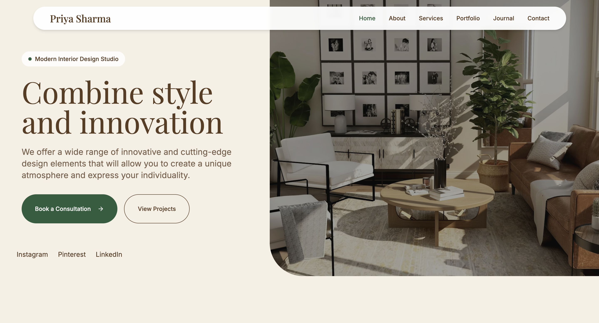

# PRIYA SHARMA - Interior Design Studio



A modern, elegant, and responsive portfolio website designed for an interior design studio. This application is built using the latest web technologies to deliver a fast, SEO-friendly, and visually stunning user experience.

## ✨ Features

- **Striking Hero Section:** A beautiful visual introduction to the studio's aesthetic.
- **Project Portfolio:** A dedicated, filterable gallery to showcase past work.
- **Journal/Blog:** An area to share design thoughts, trends, and articles.
- **Testimonial Slider:** Build trust with prospective clients through feedback.
- **Contact & Inquiry Forms:** Easy-to-use forms for potential clients to get in touch.
- **Fully Responsive:** Carefully crafted to look perfect on all screen sizes, from mobile phones to large desktop monitors.

## 🛠 Tech Stack

- **Framework:** [Next.js](https://nextjs.org/) (App Router)
- **Language:** TypeScript
- **Styling:** [Tailwind CSS](https://tailwindcss.com/)
- **UI Components:** [Radix UI](https://www.radix-ui.com/) & [shadcn/ui](https://ui.shadcn.com/)
- **Icons:** [Lucide React](https://lucide.dev/)
- **Animations:** [Framer Motion](https://www.framer.com/motion/)

## 🚀 Getting Started

First, run the development server:

```bash
npm run dev
# or
yarn dev
# or
pnpm dev
# or
bun dev
```

Open [http://localhost:3000](http://localhost:3000) with your browser to see the result.

You can start editing the page by modifying `app/page.tsx`. The page auto-updates as you edit the file.

## 📂 Project Structure

- `/app`: Contains all Next.js App Router pages and layouts.
- `/components`: Reusable UI components (buttons, sliders, headers, footers).
- `/lib`: Utility functions and static content data (`content.ts`).
- `/public`: Static assets including the logo, favicon, and placeholder images.

## 📈 Learn More

To learn more about Next.js, take a look at the following resources:

- [Next.js Documentation](https://nextjs.org/docs) - learn about Next.js features and API.
- [Learn Next.js](https://nextjs.org/learn) - an interactive Next.js tutorial.

You can check out [the Next.js GitHub repository](https://github.com/vercel/next.js/) - your feedback and contributions are welcome!

## 🚢 Deploy on Vercel

The easiest way to deploy your Next.js app is to use the [Vercel Platform](https://vercel.com/new?utm_medium=default-template&filter=next.js&utm_source=create-next-app&utm_campaign=create-next-app-readme) from the creators of Next.js.

Check out our [Next.js deployment documentation](https://nextjs.org/docs/deployment) for more details.
